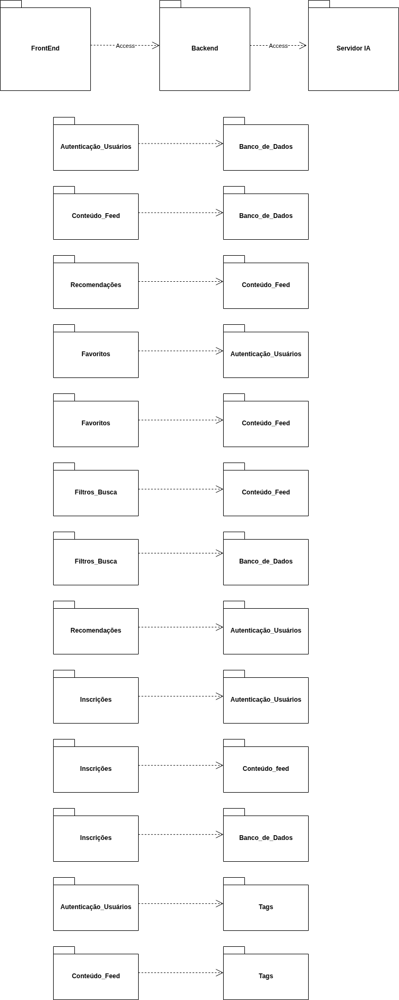
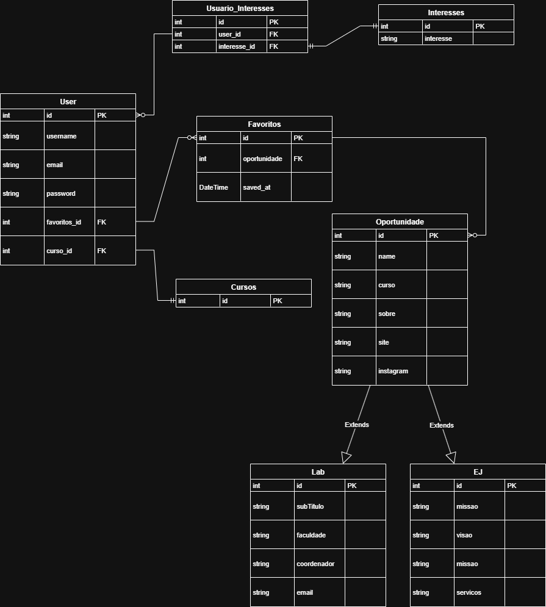

# Arquitetura Geral do Projeto - MuralUnB

## 1. Visão Geral da Arquitetura

A arquitetura do projeto MuralUnB é baseada em um modelo de **componentes desacoplados**, onde cada parte principal do sistema opera de forma independente, comunicando-se através de APIs. Essa abordagem facilita o desenvolvimento paralelo, a manutenção e a escalabilidade.

O sistema é composto por três grandes componentes:

1.  **Frontend:** A aplicação web com a qual o usuário interage diretamente. É responsável por toda a camada de apresentação e experiência do usuário.
2.  **Backend (API):** O servidor central que orquestra a lógica de negócio, gerencia a autenticação de usuários e a persistência de dados no banco de dados.
3.  **Servidor de IA (AI Server):** Um microserviço especializado, responsável por executar os algoritmos de recomendação.

O fluxo de comunicação principal é: o **Frontend** se comunica exclusivamente com o **Backend**. O **Backend**, por sua vez, se comunica com o **Servidor de IA** para obter as recomendações personalizadas.

---

## 2. Arquitetura do Frontend

O Frontend é responsável por renderizar a interface do usuário e gerenciar o estado da aplicação no lado do cliente.

### Responsabilidades:
* Renderizar todas as telas e componentes visuais definidos no Figma.
* Gerenciar o estado da aplicação (ex: dados do usuário logado, posts do feed).
* Consumir a API do Backend para buscar e enviar dados.
* Lidar com a navegação entre as diferentes páginas do site.

### Tecnologias Utilizadas:
* **Framework:** Next.js / React 
* **Linguagem:** TypeScript.
* **Estilização:** TailwindCSS.

---

## 3. Arquitetura do Backend

O Backend é uma API RESTful que serve como o coração do sistema.

### 3.1. Visão Geral do Backend
Construído com Django e Django REST Framework, sua função é expor endpoints seguros para o Frontend consumir, abstraindo toda a complexidade do banco de dados e da lógica de negócio.

### 3.2. Arquitetura Lógica (Diagrama de Pacotes)

A estrutura do backend é modular, organizada em "apps" Django, onde cada app tem uma responsabilidade única.

* **`autenticacao`**: Gerencia todo o ciclo de vida do usuário (cadastro, login, perfil, etc.).
* **`oportunidades`**: Gerencia as `Oportunidades`, `Labs` e `EJs`.
* **`interesses`**: Gerencia as `Tags` e as preferências dos usuários.
* **`favoritos`**: Implementa a lógica de "salvar para ver depois".

### 3.3. Arquitetura de Dados (DER)

O Diagrama de Entidade e Relacionamento (DER) abaixo, definido pela equipe, serve como a planta baixa do nosso banco de dados.

As entidades principais (`User`, `Oportunidade`, `Lab`, `EJ`, etc.) e seus relacionamentos (1-N e N-N) foram modelados para refletir as necessidades do design do Figma. A `Oportunidade` serve como uma entidade base, com `Lab` e `EJ` sendo suas especializações.

### 3.4. Endpoints da API (Contato com o Frontend)

Estes são os principais endpoints que o backend oferece ao frontend, organizados por funcionalidade.

#### Base URLs (Exemplos):

* **Autenticação e Usuários:** `/autenticacao/`
* **Oportunidades, Labs e EJs:** `/oportunidades/`
* **Interesses/Tags:** `/interesses/`
* **Favoritos:** `/favoritos/`
* **Inscrições:** `/inscricoes/`
* **Recomendações:** `/recomendacoes/`

#### Detalhes dos Endpoints:

| Categoria | Funcionalidade | Método HTTP | Endpoint (URL) |
| :-------- | :------------- | :---------- | :------------- |
| **Autenticação** | Cadastro de Usuário | `POST` | `/autenticacao/cadastro/` |
| | Login de Usuário | `POST` | `/autenticacao/login/` |
| | Ver Perfil do Usuário | `GET` | `/autenticacao/perfil/` |
| | Atualizar Perfil do Usuário | `PATCH` | `/autenticacao/perfil/` |
| | Alterar Senha | `POST` | `/autenticacao/alterar-senha/` |
| | Solicitar Reset de Senha | `POST` | `/autenticacao/resetar-senha/solicitar/` |
| | Confirmar Reset de Senha | `POST` | `/autenticacao/resetar-senha/confirmar/` |
| **Oportunidades** | Listar Todas as Oportunidades | `GET` | `/oportunidades/` |
| | Criar Nova Oportunidade | `POST` | `/oportunidades/` |
| | Ver Detalhes de Oportunidade | `GET` | `/oportunidades/{id}/` |
| | Atualizar Oportunidade | `PUT`/`PATCH` | `/oportunidades/{id}/` |
| | Excluir Oportunidade | `DELETE` | `/oportunidades/{id}/` |
| **Labs/EJs** | Listar Labs (Específicos) | `GET` | `/oportunidades/labs/` |
| | Listar EJs (Específicas) | `GET` | `/oportunidades/ejs/` |
| **Interesses/Tags** | Listar Todas as Tags | `GET` | `/interesses/tags/` |
| | Adicionar Tags ao Usuário | `POST` | `/interesses/user-tags/` |
| **Favoritos** | Listar Oportunidades Favoritas | `GET` | `/favoritos/` |
| | Adicionar Oportunidade aos Favoritos | `POST` | `/favoritos/` |
| | Remover Oportunidade dos Favoritos | `DELETE` | `/favoritos/{oportunidade_id}/` |
| **Inscrições** | Inscrever-se em Oportunidade | `POST` | `/inscricoes/` |
| | Listar Minhas Inscrições | `GET` | `/inscricoes/minhas-inscricoes/` |
| **Recomendações** | Obter Feed de Recomendações | `GET` | `/recomendacoes/feed/` |

---

## 4. Arquitetura do Servidor de IA (AI Server)

O Servidor de IA é um microserviço Python focado exclusivamente em processar e entregar recomendações.

### Responsabilidades:
* Receber dados do usuário (preferências, histórico) e a lista de oportunidades disponíveis.
* Executar modelos de Machine Learning (ex: filtragem colaborativa, clustering) para gerar uma lista ordenada de posts recomendados.
* Expor um endpoint simples para que o Backend possa solicitar essas recomendações.

### Tecnologias Utilizadas:
* **Linguagem:** Python.
* **Framework da API:** Flask ou FastAPI (sugestão, por serem leves).
* **Bibliotecas de IA:** Scikit-Learn, Pandas, NumPy.

### Comunicação:
O **Backend Django** fará uma requisição HTTP para o **Servidor de IA** (ex: `POST` para `/recommend`) enviando os dados necessários. O Servidor de IA processará e devolverá uma lista de IDs de posts, que o Backend então usará para buscar os dados completos no banco de dados e entregar ao Frontend.
