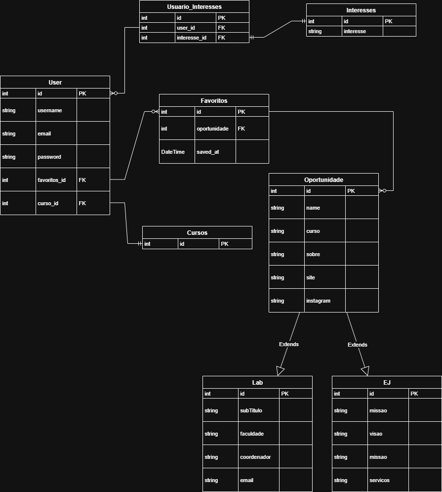
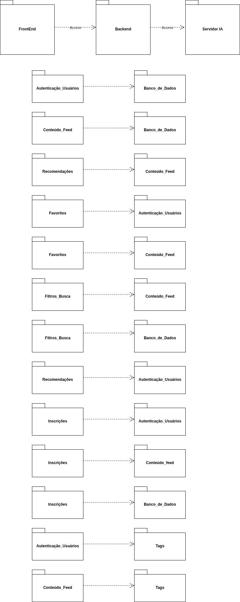

## 1. Arquitetura do Backend

O Backend é uma API RESTful que serve como o coração do sistema.

### 1.1. Visão Geral do Backend

Construído com Django e Django REST Framework, sua função é expor endpoints seguros para o Frontend consumir, abstraindo toda a complexidade do banco de dados e da lógica de negócio.

### 1.2. Arquitetura de Dados (DER)

O Diagrama de Entidade e Relacionamento (DER) abaixo, definido pela equipe, serve como a planta baixa do nosso banco de dados.

As entidades principais (`User`, `Oportunidade`, `Lab`, `EJ`, etc.) e seus relacionamentos (1-N e N-N) foram modelados para refletir as necessidades do design do Figma. A `Oportunidade` serve como uma entidade base, com `Lab` e `EJ` sendo suas especializações.

### 1.3. Arquitetura Lógica (Diagrama de Pacotes)

A estrutura do backend é modular, organizada em "apps" Django, onde cada app tem uma responsabilidade única.

- **`autenticacao`**: Gerencia todo o ciclo de vida do usuário (cadastro, login, perfil, etc.).
- **`oportunidades`**: Gerencia as `Oportunidades`, `Labs` e `EJs`.
- **`interesses`**: Gerencia as `Tags` e as preferências dos usuários.
- **`favoritos`**: Implementa a lógica de "salvar para ver depois".

### 1.4. Endpoints da API (Contato com o Frontend)

Estes são os principais endpoints que o backend oferece ao frontend, organizados por funcionalidade.

#### Base URLs (Exemplos):

- **Autenticação e Usuários:** `/autenticacao/`
- **Oportunidades, Labs e EJs:** `/oportunidades/`
- **Interesses/Tags:** `/interesses/`
- **Favoritos:** `/favoritos/`
- **Inscrições:** `/inscricoes/`
- **Recomendações:** `/recomendacoes/`

#### Detalhes dos Endpoints:

| Categoria           | Funcionalidade                       | Método HTTP   | Endpoint (URL)                           |
| :------------------ | :----------------------------------- | :------------ | :--------------------------------------- |
| **Autenticação**    | Cadastro de Usuário                  | `POST`        | `/autenticacao/cadastro/`                |
|                     | Login de Usuário                     | `POST`        | `/autenticacao/login/`                   |
|                     | Ver Perfil do Usuário                | `GET`         | `/autenticacao/perfil/`                  |
|                     | Atualizar Perfil do Usuário          | `PATCH`       | `/autenticacao/perfil/`                  |
|                     | Alterar Senha                        | `POST`        | `/autenticacao/alterar-senha/`           |
|                     | Solicitar Reset de Senha             | `POST`        | `/autenticacao/resetar-senha/solicitar/` |
|                     | Confirmar Reset de Senha             | `POST`        | `/autenticacao/resetar-senha/confirmar/` |
| **Oportunidades**   | Listar Todas as Oportunidades        | `GET`         | `/oportunidades/`                        |
|                     | Criar Nova Oportunidade              | `POST`        | `/oportunidades/`                        |
|                     | Ver Detalhes de Oportunidade         | `GET`         | `/oportunidades/{id}/`                   |
|                     | Atualizar Oportunidade               | `PUT`/`PATCH` | `/oportunidades/{id}/`                   |
|                     | Excluir Oportunidade                 | `DELETE`      | `/oportunidades/{id}/`                   |
| **Labs/EJs**        | Listar Labs (Específicos)            | `GET`         | `/oportunidades/labs/`                   |
|                     | Listar EJs (Específicas)             | `GET`         | `/oportunidades/ejs/`                    |
| **Interesses/Tags** | Listar Todas as Tags                 | `GET`         | `/interesses/tags/`                      |
|                     | Adicionar Tags ao Usuário            | `POST`        | `/interesses/user-tags/`                 |
| **Favoritos**       | Listar Oportunidades Favoritas       | `GET`         | `/favoritos/`                            |
|                     | Adicionar Oportunidade aos Favoritos | `POST`        | `/favoritos/`                            |
|                     | Remover Oportunidade dos Favoritos   | `DELETE`      | `/favoritos/{oportunidade_id}/`          |
| **Inscrições**      | Inscrever-se em Oportunidade         | `POST`        | `/inscricoes/`                           |
|                     | Listar Minhas Inscrições             | `GET`         | `/inscricoes/minhas-inscricoes/`         |
| **Recomendações**   | Obter Feed de Recomendações          | `GET`         | `/recomendacoes/feed/`                   |

---
