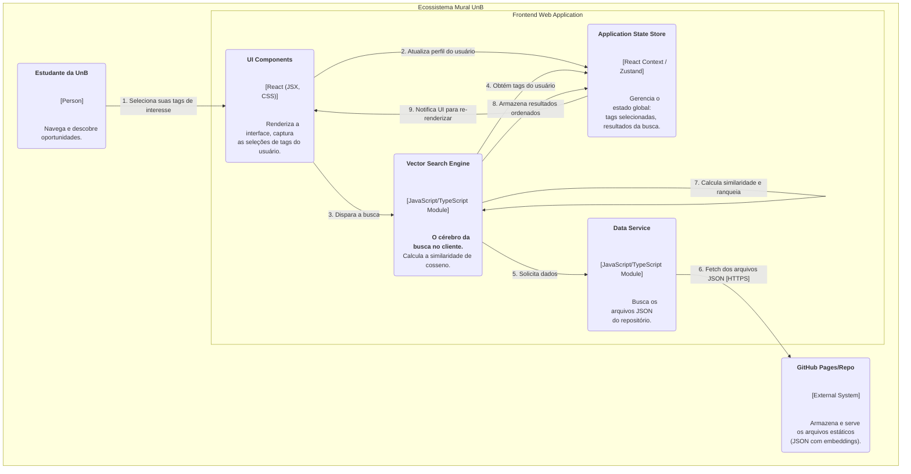

# Arquitetura Geral do Projeto - MuralUnB

> Ocorreram mudanças drásticas na arquitura geral do projeto. Documentação das mudanças em desenvolvimento

## 1. Visão Geral da Arquitetura

A arquitetura do projeto MuralUnB é baseada em um modelo de **componentes desacoplados**, onde cada parte principal do sistema opera de forma independente, comunicando-se através de APIs. Essa abordagem facilita o desenvolvimento paralelo, a manutenção e a escalabilidade.

O sistema é composto por três grandes componentes:

1.  **Frontend:** A aplicação web com a qual o usuário interage diretamente. É responsável por toda a camada de apresentação e experiência do usuário.
2.  **Backend (API):** O servidor central que orquestra a lógica de negócio, gerencia a autenticação de usuários e a persistência de dados no banco de dados.
3.  **Servidor de IA (AI Server):** Um microserviço especializado, responsável por executar os algoritmos de recomendação.

O fluxo de comunicação principal é: o **Frontend** se comunica exclusivamente com o **Backend**. O **Backend**, por sua vez, se comunica com o **Servidor de IA** para obter as recomendações personalizadas.

### 1.1 **Diagrama de Containers**

---

### 1.2 **Diagrama de Componentes**

### 2. Arquitetura de pastas

A arquitetura de pastas paras os 3 componentes do servidor estão no nosso Figma (HUB) nesse **[FIGMA](https://www.figma.com/board/S9uS0BvdNKOcX2gYhVtMDY/Mural-UnB-MDS?node-id=0-1&p=f&t=zPE9vrXMLYmNhGSM-0)**