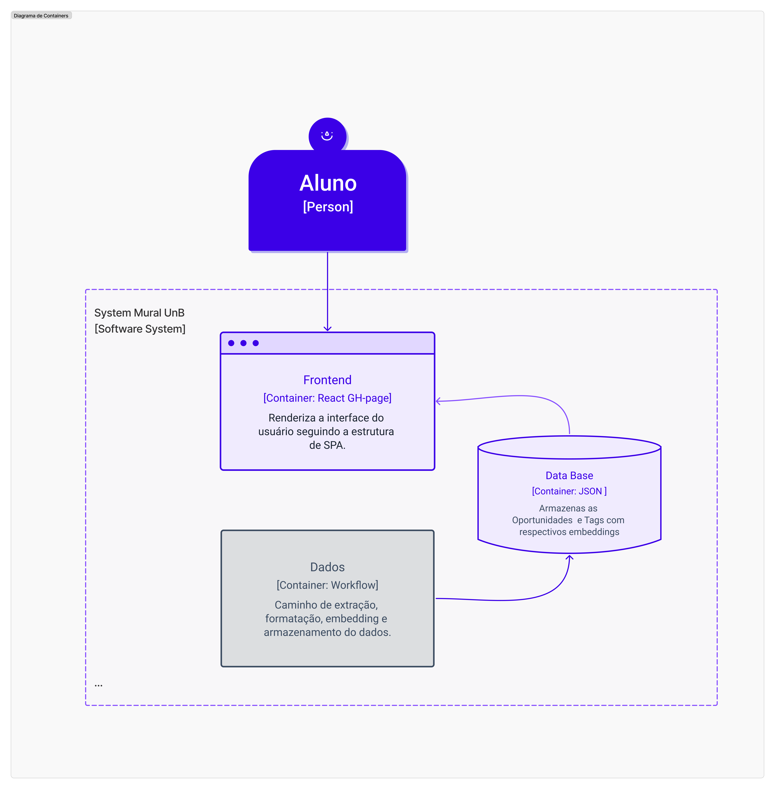

# 1. Visão Geral da Arquitetura

A arquitetura do projeto **MuralUnB** foi redesenhada para ser um sistema **serverless**, de **manutenção mínima** e **custo zero**.  
Ela se baseia em **componentes desacoplados**, separando completamente o **pipeline de ingestão de dados (offline)** do **sistema de consulta (online)**.

💡 **Justificativa:**  
A principal motivação desse design é garantir **longevidade e gratuidade**.  
A arquitetura evita custos com servidores e bancos de dados pagos, utilizando exclusivamente:
- **GitHub Pages** e **GitHub Actions** (infraestrutura gratuita do GitHub)  
- **Gemini (plano de estudante)** para geração de embeddings e classificação das tags.

---

## Estrutura Operacional

O sistema é composto por **dois contextos operacionais distintos**:

### Sistema de Consulta (Online / Frontend)
- Aplicação web (SPA) com a qual o usuário interage  
- Hospedada no **GitHub Pages**  
- Toda a lógica de negócio — incluindo **busca vetorial** e **consulta de dados** — é executada **no navegador do cliente**  
- Consome **arquivos JSON estáticos**  

### Sistema de Ingestão (Offline / Pipeline de Dados)
- Workflow automatizado via **GitHub Actions**  
- Responsável por **extrair, processar e vetorizar** (usando a **API do Gemini**) os dados de origem (ex: PDFs)  
- Gera e atualiza os **bancos de dados JSON estáticos** consumidos pelo frontend  

❌ **Não há backend tradicional** (como Django, Node.js, etc.)  
Toda a lógica e o armazenamento são gerenciados via GitHub Actions e arquivos JSON estáticos.

---

## 1.1 Diagrama de Containers

Este diagrama mostra a visão de alto nível do sistema, separando o **Frontend** (interface do usuário) do **sistema de Dados**.

**Componentes:**
- **Frontend (React GH-page):** SPA que roda no navegador do usuário  
- **Data Base (JSON):** Arquivos estáticos que armazenam as oportunidades e tags com seus embeddings  

---

## 1.2 Diagrama de Componentes

Este diagrama detalha os **componentes internos** do Frontend e do pipeline de Dados, bem como suas **interações**.

A arquitetura opera em **dois fluxos independentes**:

---

### 🔹 A. Fluxo de Consulta (Online — Lógica no Frontend)

Ocorre inteiramente no **navegador do usuário**, dentro do container *Frontend*:

1. O aluno interage com a **User Web UI** (interface React)  
2. A UI dispara uma **Busca Básica** ao **Vector Search Service**  
3. O **Vector Search Service** aciona o **Data Service** para **Buscar Vetores**  
4. O **Data Service** realiza um **fetch** diretamente nos bancos:
   - `Tags DB.json`
   - `Oportunidades DB.json`
5. Esses bancos estão hospedados junto com o site  
6. **User Vector Merge** e **State Storage** gerenciam o estado da aplicação e recalculam o vetor de interesse do usuário com base nas tags selecionadas  

---

### 🔸 B. Fluxo de Ingestão de Dados (Offline — Pipeline de GitHub Actions)

Fluxo automatizado (container *Dados*) que roda de forma assíncrona:

1. Inicia com **dados brutos** (ex: Portfólios em PDF)  
2. O **PDF Extractor** (script Python) extrai o texto  
3. O **Data Handler** formata e normaliza os dados extraídos  
4. Os dados limpos são enviados ao **Content Embedding (Gemini)** para **Vetorização**  
5. O **Vector Writer Service** atualiza os arquivos:
   - `Tags DB.json`
   - `Oportunidades DB.json`
   
Esses arquivos são armazenados no repositório do projeto e utilizados pelo frontend.

---

# 2. Arquitetura de Pastas

A **arquitetura de pastas** dos três componentes do servidor está documentada no [**Figma (HUB)**](https://www.figma.com/board/S9uS0BvdNKOcX2gYhVtMDY/Mural-UnB-MDS?node-id=0-1&p=f&t=zPE9vrXMLYmNhGSM-0)